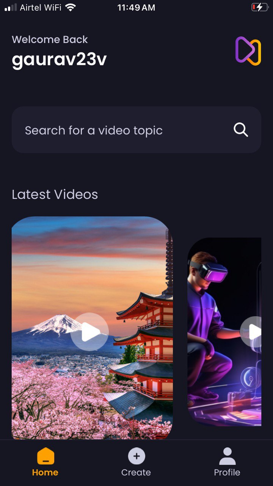

# Aura

AI Video Share is a cross-platform mobile application built with React Native that allows users to share AI-generated videos and images along with their prompts. Users can explore trending content, upload their own creations, and connect with a community of AI enthusiasts.

<div style="display: flex; justify-content: space-between;">
  
  
</div>

## Features

1. **Welcome Page**: A sleek introduction to the app's capabilities.
2. **Authentication**: Secure login and sign-up functionality powered by Appwrite backend.
3. **Home Page**: 
   - Browse the latest and trending posts
   - Play videos directly in the feed
   - Search for specific topics or content
4. **Create Page**: Upload and share your own AI-generated videos and images.
5. **Profile Page**:
   - View your total video views and upload count
   - Browse all your uploaded content
   - Track your impact in the community

## Demo

<div align="center">
  
</div>

## Installation

### Option 1: Download the APK

For the quickest installation, download our pre-built APK:
[Download AI Video Share APK](https://link-to-your-apk.com)

### Option 2: Run from Source

If you're a developer or want to customize the app, follow these steps:

1. Clone the repository:
   ```
   git clone https://github.com/gaurav23v/aura.git
   cd aura
   ```

2. Install dependencies:
   ```
   npm install
   ```

3. Start the development server:
   ```
   npm start
   ```

4. Use the Expo Go app to run the application:
   - Install Expo Go on your iOS or Android device
   - Scan the QR code displayed in your terminal with the Expo Go app
   - The app will load and run on your device

## Acknowledgments

- Thanks to the Appwrite team for providing an excellent backend solution
- Shoutout to the React Native community for their invaluable resources and support

---

Don't forget to star ⭐ this repo if you find it useful!